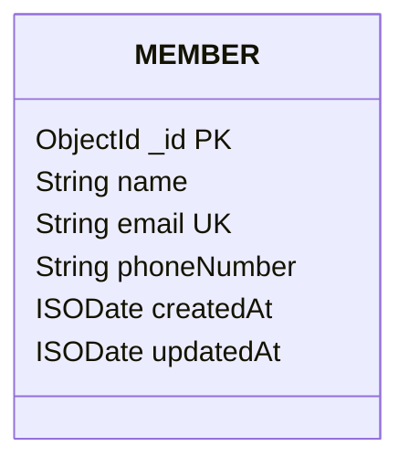
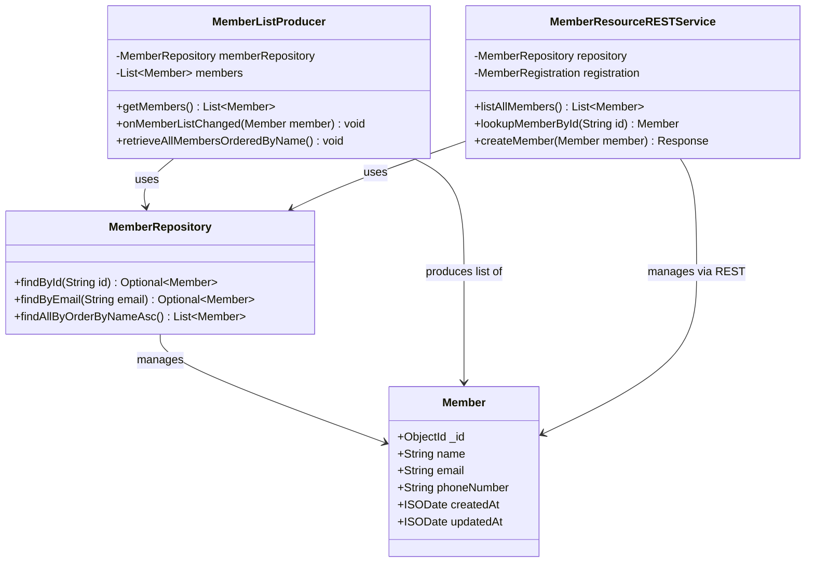

# Data Models

This document provides a visual representation of the data models used in the Kitchensink application.

## Member Document

```mermaid
classDiagram
    class Member {
        +ObjectId _id
        +String name
        +String email
        +String phoneNumber
        +ISODate createdAt
        +ISODate updatedAt
        +getId() String
        +setId(String id) void
        +getName() String
        +setName(String name) void
        +getEmail() String
        +setEmail(String email) void
        +getPhoneNumber() String
        +setPhoneNumber(String phoneNumber) void
        +getCreatedAt() Date
        +getUpdatedAt() Date
    }
    
    note for Member "Annotations\n@Document\n@CompoundIndex(name='email_idx', def='{'email': 1}', unique=true)"
    
    note for Member::_id "@Id"
    note for Member::name "@NotNull\n@Size(min=1, max=25)\n@Pattern(regexp='[^0-9]*', message='Must not contain numbers')"
    note for Member::email "@NotNull\n@NotEmpty\n@Email"
    note for Member::phoneNumber "@NotNull\n@Size(min=10, max=12)\n@Digits(fraction=0, integer=12)"
    note for Member::createdAt "@CreatedDate"
    note for Member::updatedAt "@LastModifiedDate"
```

## MongoDB Schema



## Repository Relationships



## Document Validation Rules

MongoDB provides schema validation using JSON Schema:

```javascript
{
  "validator": {
    "$jsonSchema": {
      "bsonType": "object",
      "required": ["name", "email", "phoneNumber"],
      "properties": {
        "name": {
          "bsonType": "string",
          "minLength": 1,
          "maxLength": 25,
          "pattern": "^[^0-9]*$",
          "description": "Must be a string between 1-25 characters and not contain numbers"
        },
        "email": {
          "bsonType": "string",
          "pattern": "^[a-zA-Z0-9._%+-]+@[a-zA-Z0-9.-]+\\.[a-zA-Z]{2,}$",
          "description": "Must be a valid email address"
        },
        "phoneNumber": {
          "bsonType": "string",
          "minLength": 10,
          "maxLength": 12,
          "pattern": "^[0-9]+$",
          "description": "Must be a string of 10-12 digits"
        }
      }
    }
  }
}
```
```

And here's how API_SCHEMA.md should be updated:

```markdown
# Kitchensink API Schema Documentation

This document describes the data models and schemas used in the Kitchensink API.

## Member Schema

The Member entity represents a person in the system.

### Properties

| Property     | Type     | Description                                        | Constraints                                         |
|--------------|----------|----------------------------------------------------|----------------------------------------------------|
| _id          | ObjectId | Unique identifier for the member (auto-generated)  | Primary key                                        |
| name         | String   | The name of the member                             | - Not null<br>- Size: 1-25 characters<br>- Cannot contain numbers |
| email        | String   | The email address of the member                    | - Not null<br>- Not empty<br>- Valid email format<br>- Must be unique |
| phoneNumber  | String   | The phone number of the member                     | - Not null<br>- Size: 10-12 characters<br>- Digits only |
| createdAt    | ISODate  | Timestamp when the document was created            | Auto-generated                                      |
| updatedAt    | ISODate  | Timestamp when the document was last updated       | Auto-updated on modification                        |

### JSON Representation

```json
{
  "_id": "60a6f63d5f8ee27e1a61dea4",
  "name": "John Smith",
  "email": "john.smith@example.com",
  "phoneNumber": "1234567890",
  "createdAt": "2023-05-01T12:00:00.000Z",
  "updatedAt": "2023-05-01T12:00:00.000Z"
}
```

### Validation Rules

#### Name
- Must not be null
- Length must be between 1 and 25 characters
- Must not contain numeric characters (matching regex: "[^0-9]*")

#### Email
- Must not be null
- Must not be empty
- Must be a valid email format
- Must be unique in the system

#### Phone Number
- Must not be null
- Length must be between 10 and 12 characters
- Must contain only digits

## MongoDB Schema

The Member entity is mapped to a MongoDB collection with the following structure:

### Member Collection

| Field          | Type     | Constraints                |
|----------------|----------|----------------------------|
| _id            | ObjectId | Primary Key                |
| name           | String   | Not Null                   |
| email          | String   | Not Null, Unique           |
| phoneNumber    | String   | Not Null                   |
| createdAt      | ISODate  | Auto-generated             |
| updatedAt      | ISODate  | Auto-updated               |

## Collection Schema Diagram

```
┌──────────────────────────┐
│     Member               │
├──────────────────────────┤
│ _id: ObjectId (PK)       │
│ name: String             │
│ email: String (UK)       │
│ phoneNumber: String      │
│ createdAt: ISODate       │
│ updatedAt: ISODate       │
└──────────────────────────┘