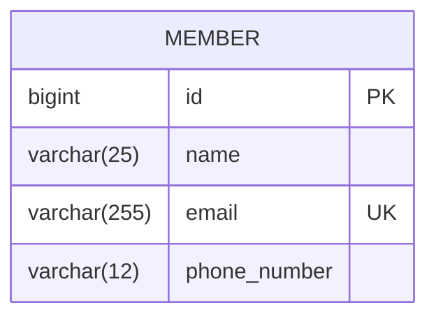
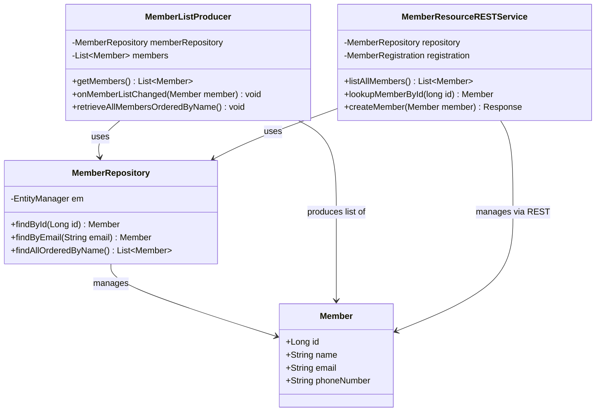

# Data Models

This document provides a visual representation of the data models used in the Kitchensink application.

## Member Entity

```mermaid
classDiagram
    class Member {
        +Long id
        +String name
        +String email
        +String phoneNumber
        +getId() Long
        +setId(Long id) void
        +getName() String
        +setName(String name) void
        +getEmail() String
        +setEmail(String email) void
        +getPhoneNumber() String
        +setPhoneNumber(String phoneNumber) void
    }
    
    note for Member "Annotations\n@Entity\n@XmlRootElement\n@Table(uniqueConstraints=@UniqueConstraint(columnNames='email'))"
    
    note for Member::id "@Id\n@GeneratedValue"
    note for Member::name "@NotNull\n@Size(min=1, max=25)\n@Pattern(regexp='[^0-9]*', message='Must not contain numbers')"
    note for Member::email "@NotNull\n@NotEmpty\n@Email"
    note for Member::phoneNumber "@NotNull\n@Size(min=10, max=12)\n@Digits(fraction=0, integer=12)\n@Column(name='phone_number')"
```

## Database Schema



## Repository Relationships

